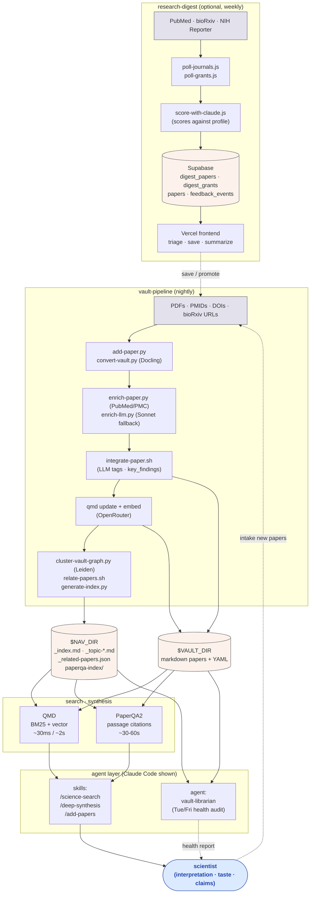

# Architecture

Technical reference. Read once before running anything — the pipeline has hard invariants and violating them causes hash-churn re-embedding events that cost real money.

## System diagram



Solid arrows are automated data flow; dotted arrows are human-mediated. The two data stores (`$VAULT_DIR` and `$NAV_DIR`) are the durable artifacts — everything else is regenerable. The research-digest subsystem is optional; the vault pipeline plus search stack works standalone.

## Design principles

1. **The vault is the durable artifact.** Plain markdown files with rich YAML frontmatter. Human-readable, LLM-readable, grep-able, diffable, version-controllable, portable across tools.
2. **Derived data lives next to the vault, not in it.** Topic clusters, indexes, neighbor sidecars, caches — all in a separate `nav/` directory that is *not* indexed by the search stack. Mixing derived data into the vault causes hash churn.
3. **LLMs handle triage, summarization, recall, and connection-finding. Scientists own interpretation.** The system surfaces evidence and lets the scientist judge it.
4. **Pull-based retrieval, not preloading.** Sessions load only what the question requires. A small index file (`_index.md`) and topic-cluster files (`_topic-*.md`) let an LLM orient without reading every paper.
5. **Two complementary search tools, not one.** [QMD](https://github.com/tobi/qmd) for fast lexical and vector search (~30 ms / ~2 s). [PaperQA2](https://github.com/Future-House/paper-qa) for slow synthesis with passage-level citations (~30–60 s).

## The vault

Plain markdown, one file per paper, in `$VAULT_DIR`. Each file has rich YAML frontmatter:

```yaml
---
title: "..."
authors: ["...", "..."]
year: 2024
journal: "..."
pmid: 12345678
pmcid: PMC1234567
doi: 10.xxxx/yyyy
type: research | review | preprint | ...
subtopics: [...]      # MeSH-derived
tags: [...]           # LLM-assigned factual descriptors
key_findings: [...]   # 3-5 bullet points, LLM-extracted
status: in-review | preprint | in-press | (omitted)
enrichment_status: pmcid | pubmed | abstract-only | llm | failed
integrated: true | false
full_text: true | false
---

[paper body, converted from PDF or PMC JATS]
```

Frontmatter is the search and navigation surface. The body is the evidence.

### `status:` field — publication status

| Value | Meaning |
|---|---|
| `in-review` | Unpublished manuscript. **Never cite as published evidence.** |
| `preprint` | bioRxiv/medRxiv with DOI; may or may not have PMID. |
| `in-press` | Accepted; may have PMID; not final. |
| (omitted) | Standard published paper. The default. |

### `enrichment_status:` — pipeline processing status (set automatically)

| Value | Set by | Meaning |
|---|---|---|
| `pmcid` | `add-paper.py` / `upgrade-stubs.py` | PMC full text validated to have body sections. |
| `pubmed` | `enrich-paper.py` | PubMed metadata; full text from PDF conversion. |
| `abstract-only` | `add-paper.py` | No PMC full text. Abstract only. |
| `llm` | `enrich-llm.py` | Sonnet-extracted metadata (PDF pipeline fallback). |
| `failed` | `enrich-paper.py` | PubMed lookup failed. Tier 3 will retry. |

## The navigation layer (`$NAV_DIR`)

Three layers of pull-based navigation. The vault is the data; this is how you find anything in it without reading every paper.

**Layer 1 — `_index.md` (~150 lines).** Master lookup table. One row per paper: filename, PMID, year, author, journal, type, topics. Read first to confirm what's in the vault. Regenerated nightly from the vault. The footer (topic-cluster cross-reference) is sorted deterministically so the index doesn't churn when cluster membership shifts slightly.

**Layer 2 — `_topic-*.md` files (~50 communities).** Themed paper lists with one-line key findings per paper and a "Related clusters" footer. Generated nightly by `cluster-vault-graph.py` using Leiden community detection on the k-NN embedding graph (k=15, resolution=8.0), then labeled by Claude Sonnet with a label cache (`_topic-cache.json`). **Cluster names are dynamic** — they may shift between runs when membership changes >10%. Never hardcode cluster names anywhere.

**Layer 3 — individual papers.** Full text + frontmatter. Retrieved via `mcp__qmd__get` or by direct file read.

Other artifacts in `$NAV_DIR`:

- **`_related-papers.json`** — paper-to-paper neighbor sidecar. Cosine similarity over embeddings. Canonical source for "what's near this paper." Computed by `relate-papers.sh` (zero API calls; uses already-computed embeddings).
- **`_manifest.json`** — source-file manifest. Tracks DOI → vault-file mapping so re-conversion of the same PDF is idempotent. Supports a `skip: true` flag for sources that should never resurface (e.g., intentionally deleted papers, duplicate variants).
- **`_topic-bridges.md`** — papers that bridge two or more clusters. Useful for cross-area synthesis.
- **`paperqa-index/`** — PaperQA2's `.pkl` index. Tracks body-text sha256 per file so stub upgrades and preprint upgrades trigger re-index, but frontmatter-only edits do not.

## The Pipeline Contract — hard invariants

Anything writing into the vault must obey these. Past violations caused embedding-cost spikes.

1. **Paper markdown in `$VAULT_DIR` is primary content.** It is embedded by QMD. **Never write derived metadata into it as a recurring operation.**
2. **Derived artifacts live in `$NAV_DIR`.** Topic clusters, index files, sidecars, caches, manifests. Outside the search-stack scan path. Never embedded.
3. **Any write to paper frontmatter is a deliberate re-embedding event.** It changes the file hash and triggers a QMD re-embed. Don't do it casually.
4. **Sidecars are authoritative for volatile relationships.** `_related-papers.json` is the canonical source for paper-to-paper neighbors. Don't write neighbor lists into paper frontmatter.
5. **QMD `--collection` does not scope `embed`/`update`.** Confirmed upstream bug ([tobi/qmd#558](https://github.com/tobi/qmd/issues/558)). Scoping is enforced by cron ordering, not by the flag. **Never combine `-f` (force) with `-c` (collection)** — the `-c` is dropped, `-f` wipes vectors globally.
6. **Reviews and topic clusters are navigation aids, not evidence.** Cite primary papers, not the cluster file or the librarian's report.
7. **In-review papers must never be cited as published evidence** in grants or manuscripts. The `status:` field exists to flag this.

### Pre-flight checklist for any new pipeline step

Before adding an enrichment script, cron job, or automated writeback:

1. Does this write to a file the search stack indexes?
2. Is the thing being written *primary content* or *derived metadata*? Derived → sidecar in `$NAV_DIR`.
3. Is the write deterministic on stable input, or does it shift run-to-run from LLM labels / timestamps / random seeds? Non-deterministic → automatic churn.
4. Will any LLM or human actually consume this via vector search, or only via path retrieval? Path-only → must not be embedded.
5. Does this artifact belong in the vault or in `$NAV_DIR`? When tempted to write derived data into the vault, you're about to cause a hash-churn incident.

## Search and synthesis stack

Two tools. Use the cheaper one first.

**[QMD](https://github.com/tobi/qmd)** — fast search.
- BM25 keyword: ~30 ms
- Vector search: ~2 s (3072-dim embeddings via OpenRouter)
- MCP-callable from Claude Code
- Two collections: `vault` (papers) and any other collection you maintain (e.g., personal notes)

**[PaperQA2](https://github.com/Future-House/paper-qa)** — synthesis with passage-level citations.
- `.pkl` index of chunked + embedded papers
- ~30–60 s per query
- Returns a synthesized answer with quoted passages and source filenames
- Use for mechanism questions, gap analyses, evidence summaries — not for "find papers about X" (use QMD)

### 4-tier paper reading protocol

Use the cheapest tier that answers the question.

| Tier | Method | When |
|---|---|---|
| 1 | Topic cluster `key_findings` (already loaded from `_topic-*.md`) | Always first. Answers most questions without needing deeper retrieval. |
| 2 | `mcp__qmd__get` with line cap (~80 lines) | Abstract + frontmatter. Before any deeper retrieval. |
| 3 | `/deep-synthesis` (PaperQA2) | When abstract isn't enough. |
| 4 | Subagent reading full paper | Papers >30k chars needing methods, data tables, exact quotes. Never load these into the main session. |

## Intake pipeline

Two paths.

### Primary: PMID-first via `add-paper.py`

```bash
# From RIS file
add-paper.py --ris papers.ris

# Direct PMIDs
add-paper.py 12345678 87654321

# Bulk
add-paper.py --file pmids.txt --batch-size 50

# bioRxiv / medRxiv DOIs
add-paper.py --biorxiv 10.1101/2024.xx.xxx
```

Per paper: parse RIS → fetch PubMed metadata → check PMCID → fetch PMC JATS XML if available → **validate that PMC returned real body sections** (not abstract-only) → fall back to abstract-only stub if no PMC → skip if already in vault.

PMC coverage in practice: ~45% overall, ~70% for 2020s papers, mostly abstract-only pre-2000. `upgrade-stubs.py` re-checks abstract-only papers nightly for newly-deposited PMC text.

### Secondary: PDF via Docling (Endnote workflow)

For paywalled papers without PMC. Drop PDFs into `$SOURCE_DIR`. Nightly `sync-vault.sh` does:

1. **Convert** — Docling extracts text + structure from each PDF; DOI extracted from first 2 pages, conversion skipped if DOI already in vault.
2. **Dedup** — `check-duplicates.py --auto-resolve` catches remaining duplicates by PMID/DOI/title. Canonical pick is metadata-driven (PMID > PMCID-grade > full_text > integrated > word_count > filename length).
3. **Enrich (Tier 2)** — `enrich-paper.py` matches against PubMed via cascading search (DOI → author+page → title keywords → filename). Every match verified by checking the PubMed title appears in body text. Mismatches rejected — unenriched is preferable to falsely-matched.
4. **Enrich (Tier 3)** — `enrich-llm.py` is the safety net. Sends first 60 lines of body to Claude Sonnet to extract title/authors/year/journal/DOI for papers PubMed couldn't match.
5. **Stub upgrade** — `upgrade-stubs.py` re-checks abstract-only papers for new PMC deposits.
6. **Preprint upgrade** — `upgrade-preprints.py` checks if a preprint has been published.
7. **Integrate** — `integrate-paper.sh` runs Claude Sonnet against the paper text (no file-write tools) to emit a structured JSON block of `tags:` and `key_findings:`. The shell script then parses that JSON and patches the paper's frontmatter. Splitting "LLM proposes" from "shell script writes" means a malformed or wrong-paper response cannot accidentally rewrite arbitrary fields elsewhere in the vault.
8. **Re-embed** — `qmd update && qmd embed` updates the vector store for changed/new files only.
9. **Relate** — `relate-papers.sh` recomputes `_related-papers.json` (zero API calls; uses already-computed embeddings).
10. **Cluster** — `cluster-vault-graph.py` rebuilds Leiden communities and Sonnet labels, then regenerates `_index.md`.
11. **PaperQA2 index** — `paperqa-index.py` re-indexes papers whose body sha256 has changed.

### Unpublished, in-review, and preprint papers

Automated pipeline only handles published papers. Manual path:

1. Place file in `$SOURCE_DIR/manual/` and convert with Docling.
2. Add `status:` field to frontmatter (`in-review`, `preprint`, or `in-press`).
3. `integrate-paper.sh` works normally — reads whatever text is available.
4. When published: update `status:`, add PMID, run `enrich-paper.py --force`.

## Embedding model

Currently **`google/gemini-embedding-2-preview` via OpenRouter**, 3072-dim. The vault, the PaperQA2 index, the research-digest profile, and any other collection share this vector space. **Keep them aligned on any future model swap** — mismatched models give nonsense neighbors.

Format prefix differs by tool:
- QMD wrapper: `google/gemini-embedding-2-preview`
- PaperQA / litellm: `openrouter/google/gemini-embedding-2-preview`

`relate-papers.sh` uses `MIN_SCORE = 0.83` (calibrated for this model). Re-tune with `--dry-run --min-score X` if the model ever changes.

`qmd embed --force` is a **global wipe** — clears all vectors regardless of `--collection`. Subsequent `embed --collection X` (no `--force`) picks up orphaned hashes. Use `--force` deliberately.

## Automation schedule

Example crontab in [`cron/example-crontab`](cron/example-crontab). Typical schedule:

| Schedule | Job |
|---|---|
| Daily midnight | Vault pipeline: convert → dedup → enrich → integrate → re-embed → relate → cluster → re-index |
| Daily 1 AM | Other-collection re-embed (runs *after* vault sync — see Pipeline Contract item 5) |
| Tue/Fri 4 AM | Vault librarian: health check |
| Sunday 4 AM | Research digest: poll → score → store |

**Critical ordering:** any other-collection re-embed cron must run *after* the vault re-embed cron. The `--collection` flag is silently ignored upstream; ordering is the only enforcement.

## Research digest

Separate weekly pipeline. Polls PubMed, bioRxiv, and NIH Reporter; scores against a researcher profile (cosine similarity over embeddings + Claude relevance scoring); stores in a database (live deploy: Supabase); serves a frontend for triage (live deploy: Vercel). Either layer is swappable.

Reliability features:

- **Run-scoped artifacts.** Each run writes to `runs/YYYY-MM-DD-HHMMSS/` instead of fixed `/tmp` paths.
- **Seen-state on success only.** A run only marks PMIDs as "seen" after successful upsert. Aborted runs leave dedup state untouched so the next cron retries.
- **Fail-closed scoring.** If scoring or summary failure rate exceeds `DIGEST_SCORING_ABORT_THRESHOLD_PCT` / `DIGEST_SUMMARY_ABORT_THRESHOLD_PCT` (default 50%), the run aborts **before** any database write. Run-report tags `result: "abort"` (with reason) or `result: "partial"`.
- **Tests.** `node:test` covers threshold logic, seen-state lifecycle, PostgREST filter encoding, and HTML sanitizer XSS resistance.

The vault librarian's Section 8 audits the most recent run-report Tue/Fri. Saved digest papers can be promoted to the vault via `/add-papers`.

## Recovery

| Failure mode | First step |
|---|---|
| Embedding-cost spike / unexpected re-embed of many papers | Pipeline Contract violated — find the script writing to paper frontmatter or non-deterministically rewriting `$NAV_DIR` files |
| QMD `SQLITE_CONSTRAINT_UNIQUE` on update/embed | Duplicate source files in vault. Run `check-duplicates.py --auto-resolve` first; **do not** `qmd cleanup` as first resort (destroys embedding cache) |
| `vec_rowids` collapses to near-zero while `content_vectors` stays full | The dim-mismatch silent-wipe pattern. Now blocked at source by the store.ts patch (`QMD_ALLOW_VEC_RECREATE` ack required). If you see it anyway, the patch was lost during a `bun update -g qmd` — re-apply both QMD patches, then `qmd embed --force` to rebuild. |
| `vec_rowids` ≈ `content_vectors` but per-hash chunk seq has internal gaps | Partial-embed failure (transient API errors mid-bulk-embed). Plain `qmd embed` will NOT retry — keys on `seq=0` only. Repair: `DELETE FROM content_vectors WHERE hash IN (affected hashes)` then `qmd embed`. The store.ts UNIQUE handler swallows duplicates for chunks already in vec0. |
| `add-paper.py` silently failing on bioRxiv | `api.biorxiv.org` returns "Not available"; `www.biorxiv.org` blocks urllib via Cloudflare TLS fingerprinting. Workaround: curl HTML scrape (already in `add-paper.py`) |
| `claude -p` failing under cron/nohup | Four pitfalls: stderr redirect, PATH for nvm, nohup stdin, prompt size scaling. See script comments. |
| Pipeline step writing to paper files outside its lane | Every nightly script that writes frontmatter must filter on `status:` and skip categories owned by sibling scripts |
| Research digest run aborted or partial | Inspect `runs/<latest>/run-report.json`. Aborted runs leave seen-state uncommitted, so next cron re-polls |

## Why this design

Each architectural choice came from a real incident or constraint. A few worth knowing:

- **Sidecar neighbors instead of frontmatter `related_papers:`.** Writing neighbors into frontmatter triggered vault-wide re-embed every time relationships were recomputed. Sidecars are cheap to rewrite.
- **Dynamic clustering instead of a static topic registry.** The first version had a hand-curated registry that drifted out of sync with the actual paper set. Leiden community detection on the embedding graph self-updates.
- **Validation that PMC returned real body sections.** Earlier versions trusted PMC API responses; some return abstract-only with full-text headers. False `full_text: true` polluted synthesis.
- **Split "LLM proposes" from "shell script writes" in `integrate-paper.sh`.** The LLM is invoked without file-write tools; it returns JSON. The shell script parses the JSON and patches the targeted paper's frontmatter. A malformed or wrong-paper response cannot accidentally rewrite arbitrary fields elsewhere.
- **Body-sha256 tracking in PaperQA2 index.** Stub upgrades and preprint upgrades change body content; frontmatter-only edits don't. Tracking hashes lets re-index target only papers whose evidence content actually changed.
- **Backstops at three levels for each known failure mode.** Root-cause fix in the script or patch, nightly automated check that catches a regression at the same layer, and Tue/Fri librarian sweep that catches anything missed. The store.ts `QMD_ALLOW_VEC_RECREATE` guard, sync-vault.sh Step 2a parity + seq-gap checks, and the librarian's section 6b cover one such failure mode (vec0 silent-wipe + partial-embed gaps); the same shape applies to dedup ordering, frontmatter-stuck-state, and the related-papers sidecar shrinkage guard.

## See also

- [`docs/setup.md`](docs/setup.md) — step-by-step install
- [`docs/customization.md`](docs/customization.md) — what to change for your research area
- [`docs/responsible-use.md`](docs/responsible-use.md) — human judgment, provenance, NIH/journal policies
- [`docs/whats-not-included.md`](docs/whats-not-included.md) — explicit list of what you'll need to build yourself
